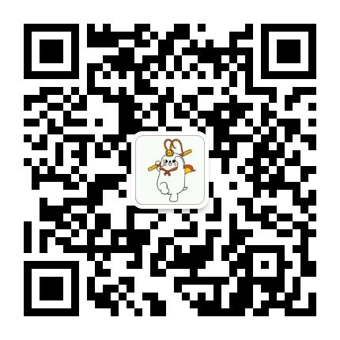

## kidemo
kid demo,像小孩学习一样的demo。

### 数据资源
关注微信公众号【啊啦嘻哈】，回复【kidemo】获取以下资源。



* 文字格式ttf文件，全部为免费商用字体。
* markdown主题渲染的css文件。
* 幽默笑话汇总。

### async异步编程
async_demo

* 异步函数的写法。
* 异步函数怎么执行。
* 异步函数怎么获取返回的结果。

### Tornado异步访问
tornado_httprequest_demo

* Tornado怎么访问web接口。
* Tornado怎么获取接口返回的数据。
* 怎样获取到异步返回的数据。
* 用callback的方式处理Tornado返回的数据。
* 用常规方式处理Tornado返回的数据。

### Tornado服务部署
tornado_httpserver_demo

* 怎样部署Tornado的web服务或接口。
* GET和POST方法的构建方法。

### 文字转为图片
text_to_image

* 把文字转为图片，可以制作点阵文字。
* 可以设置文字类型和文字大小。
* 可以用命令行方式执行，说明如下：

```
usage: 把文本转为图片。

python text_to_image.py [-h] [-i INPUT] [-o OUTPUT] [-f FONT] [-s SIZE]

optional arguments:
  -h, --help            show this help message and exit
  -i INPUT, --input INPUT
                        需要转为图片的文字。
  -o OUTPUT, --output OUTPUT
                        保存图片的路径。
  -f FONT, --font FONT  文字类型文件路径。
  -s SIZE, --size SIZE  文字大小。
```

### 图片转为字符画
image_to_character_painting

* 把图片转为字符画显示。
* 可以设置字符画的字符。
* 可以用命令行方式执行，说明如下：

```
usage: 把图片转为字符画。

python image_to_character_painting.py [-h] [-i INPUT] [-o OUTPUT] [-W WIDTH] [-H HEIGHT] [-t TABLE]

optional arguments:
  -h, --help            show this help message and exit
  -i INPUT, --input INPUT
                        需要转为字符画的图片路径。
  -o OUTPUT, --output OUTPUT
                        保存字符画的文本路径，如果为空则打印到屏幕。
  -W WIDTH, --width WIDTH
                        字符画的长度。
  -H HEIGHT, --height HEIGHT
                        字符画的高度。
  -t TABLE, --table TABLE
                        字符的列表。
```

### markdown格式文本转为html
md_to_html

* 把markdown格式编辑的md文本渲染为html格式显示。
* 可以设置渲染html的风格CSS。
* 可以用命令行方式执行，说明如下：

```
usage: 把markdown格式文本转为html。

python md_to_html.py [-h] [-i INPUT] [-o OUTPUT] [-c CSS]

optional arguments:
  -h, --help            show this help message and exit
  -i INPUT, --input INPUT
                        需要转为html的md文件路径。
  -o OUTPUT, --output OUTPUT
                        保存html的路径。
  -c CSS, --css CSS     主题文件CSS路径。

```

### 生成幽默笑话的markdown文本。
combine_joke

* 从幽默数据库导出幽默笑话，人工审核，如果选择则拟定标题，选择10则幽默笑话组成文档。
* 生成md文本的幽默笑话底稿。
